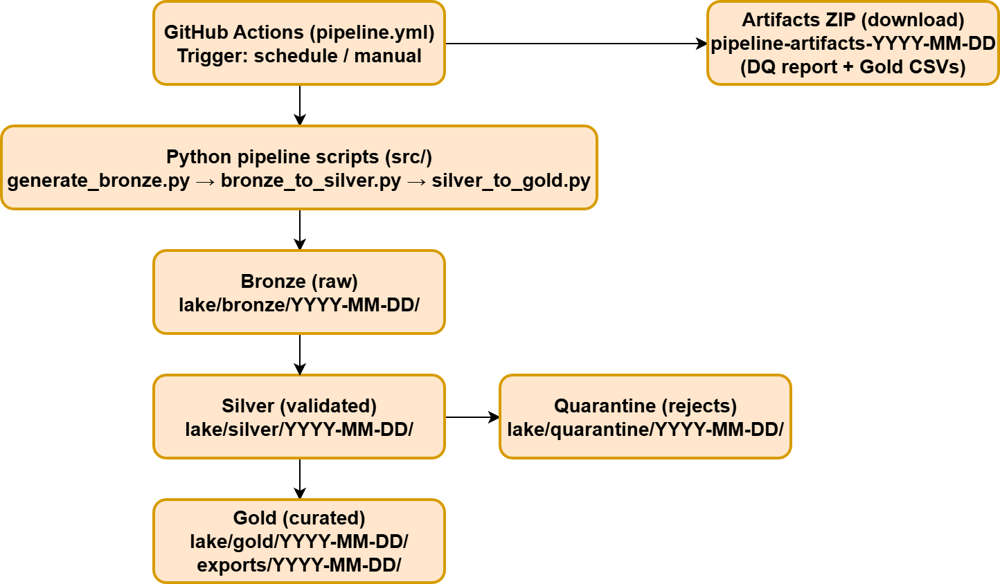

# Industrial operations & maintenance data pipeline (synthetic)

This repo demonstrates an "Azure-style" data pipeline using free tooling, designed to mirror a typical
manufacturing / industrial analytics scenario (multi-plant data consolidation).

## Architecture

## Scenario
Daily ingest of synthetic data from multiple plants:
- Asset registry (machines/pumps/lines) and plant master data
- Time-series sensor readings (temperature, vibration, pressure, flow)
- Maintenance work orders (preventive/corrective)
- Quality inspection checks (pass/fail + defect codes)

Pipeline pattern:
ingest -> land to lake -> transform/validate -> publish curated tables -> monitoring + governance notes.

## Data lake zones
- lake/bronze: raw landed files (as received)
- lake/silver: cleaned/standardized/conformed data
- lake/gold: curated “business-ready” tables/exports
- lake/quarantine: rejected records with reason codes

## Azure mapping (transferable)
- Orchestration (Azure Data Factory) -> GitHub Actions
- Data lake (ADLS Gen2) -> /lake (bronze/silver/gold/quarantine)
- Serving layer (Azure SQL / Synapse) -> curated Gold CSV exports
- Secrets (Key Vault) -> GitHub Secrets (pattern)
- Monitoring (Azure Monitor / Log Analytics) -> Actions run history + logs + artifacts

## Outputs (to be generated)
- Synthetic daily batch files in lake/bronze/
- Curated tables in lake/gold/ and exports/
- Data quality report in reports/

## Run the pipeline (GitHub Actions)

- Go to: Actions -> telemetry-pipeline-demo -> Run workflow
- Optional: set `run_date` as YYYY-MM-DD (UTC). Leave empty to use today's UTC date.
- Open the run:
  - The run Summary shows a short “Telemetry pipeline run summary”.
  - Outputs are provided as a downloadable Artifact ZIP.

## Download outputs (Artifacts)

- In the run page, scroll to **Artifacts** and download:
  - `pipeline-artifacts-YYYY-MM-DD.zip`

The ZIP contains:
- `reports/dq_YYYY-MM-DD.md`
  - Data Quality (DQ) report: counts + reject reasons from Bronze -> Silver
- `lake/bronze/YYYY-MM-DD/generation_meta.json`
  - Metadata about the synthetic generation (seed, bad_rate, row counts)
- `lake/quarantine/YYYY-MM-DD/sensor_readings_rejects.csv`
  - Rows rejected by validation (kept for audit/debug)
- `lake/gold/YYYY-MM-DD/*.csv`
  - Curated “business-ready” outputs (e.g., plant KPIs, asset health)
- `exports/YYYY-MM-DD/*.csv`
  - Convenience copies for easy viewing/sharing

Note:
- Generated data is not committed to git (keeps the repo clean).
- Use the artifact ZIP as the “evidence package” for each run.

